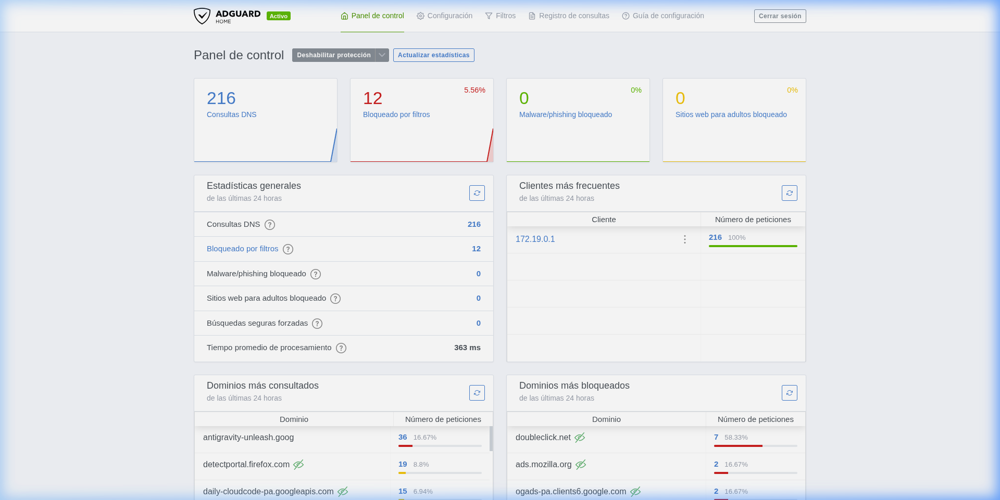
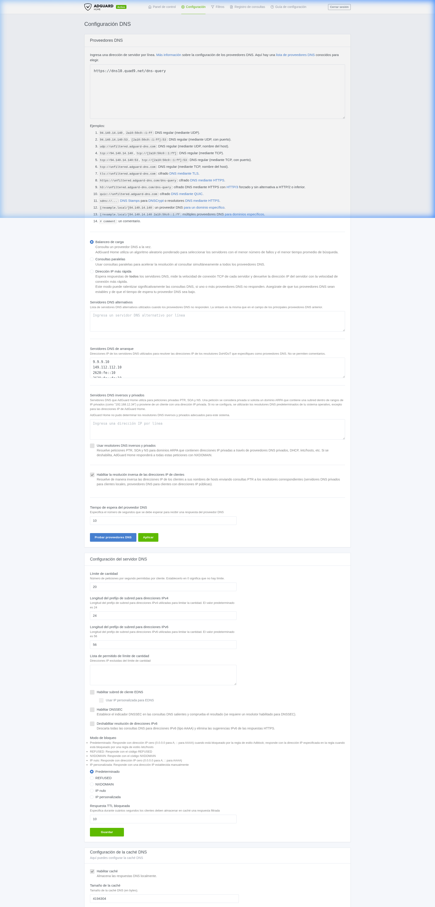

# Pràctica AdGuard Home — Bloc 4 · Tallafocs

**Mòdul:** 0378 Seguretat i alta disponibilitat  
**Centre:** Institut El Calamot  
**Curs:** 2025-2026  
**Alumne:** Izan Gómez Solano

---

## Índex

1. [Objectiu](#1-objectiu)
2. [Requisits previs](#2-requisits-previs)
3. [Desplegament amb Docker Compose](#3-desplegament-amb-docker-compose)
4. [Configuració inicial (Wizard)](#4-configuració-inicial-wizard)
5. [Activació de llistes de filtratge](#5-activació-de-llistes-de-filtratge)
6. [Regles de filtratge personalitzades](#6-regles-de-filtratge-personalitzades)
7. [Configuració DNS de l'equip](#7-configuració-dns-de-lequip)
8. [Demostració de bloqueig](#8-demostració-de-bloqueig)
9. [Panell de control](#9-panell-de-control)
10. [Explicació de decisions](#10-explicació-de-decisions)

---

## 1. Objectiu

Desplegar **AdGuard Home** com a servidor DNS local mitjançant Docker Compose, configurar-lo com a DNS principal de la màquina, activar llistes de filtratge per bloquejar dominis de publicitat i rastreig, i documentar tot el procés com a part de la pràctica de tallafocs del curs 2026.

---

## 2. Requisits previs

- Sistema operatiu: **Debian 13 (Trixie)**
- Docker Engine i Docker Compose v5.1.3 instal·lats
- L'usuari ha de pertànyer al grup `docker` per a la gestió dels volums persistents

---

## 3. Desplegament amb Docker Compose

### Fitxer `docker-compose.yml`

```yaml
services:
  adguardhome:
    image: adguard/adguardhome
    container_name: adguardhome
    restart: unless-stopped
    ports:
      - "53:53/tcp"
      - "53:53/udp"
      - "3000:3000/tcp"
    volumes:
      - adguard_work:/opt/adguardhome/work
      - adguard_config:/opt/adguardhome/conf

volumes:
  adguard_work:
  adguard_config:
```

### Explicació dels paràmetres

| Paràmetre | Descripció |
|---|---|
| `image: adguard/adguardhome` | Imatge oficial d'AdGuard Home des del repositori oficial |
| `ports` | Exposició del port 53 (DNS) i del 3000 (Panell Web) |
| `volumes` | **Volúmens persistents** gestionats per Docker per assegurar que la configuració no es perdi en reiniciar el contenidor |

---

## 4. Configuració inicial (Wizard)

Un cop aixecat el contenidor, hem accedit a `http://localhost:3000` i completat el wizard inicial:
- Interfícies d'escolta configurades a `0.0.0.0`
- Creació d'usuari: `admin`
- Contrasenya: `alumnat.`

---

## 5. Activació de llistes de filtratge

Des del menú *Filtros > Listas de bloqueo DNS* hem activat:
- **AdGuard DNS filter**
- **AdAway Default Blocklist**


---

## 6. Regles de filtratge personalitzades

S'ha afegit una regla personalitzada per bloquejar manualment el domini `doubleclick.net`:
```
||doubleclick.net^
```


---

## 7. Configuració DNS de l'equip

Hem configurat la connexió de xarxa per utilitzar el nostre AdGuard Home com a servidor de resolució:

```bash
nmcli con mod WIFI_MODS ipv4.dns '127.0.0.1' ipv4.ignore-auto-dns yes
nmcli con up WIFI_MODS
```

Verificació al fitxer de configuració del sistema:
```bash
$ cat /etc/resolv.conf
nameserver 127.0.0.1
```

---

## 8. Demostració de bloqueig

### Prova amb `dig`
La consulta retorna l'adreça `0.0.0.0`, el que indica que el domini està bloquejat pel filtre DNS:

```bash
$ dig @127.0.0.1 doubleclick.net
...
doubleclick.net.	10	IN	A	0.0.0.0
```

### Prova al navegador
Al intentar accedir a `doubleclick.net`, el navegador no pot carregar la pàgina ja que la resolució DNS ha estat interceptada per AdGuard.


---

## 9. Panell de control

El dashboard principal mostra les estadístiques globals de consultes i bloquejos realitzats.



---

## 10. Explicació de decisions

- **Persistència:** Hem optat per volúmens nombrats de Docker perquè són més robustos per a la persistència de dades a llarg termini.
- **Configuració DNS:** Hem definit servidors Upstream segurs (Quad9) per a les consultes no bloquejades, garantint la privacitat del tràfic.
- **Capa de seguretat:** AdGuard Home actua com un tallafocs a la capa d'aplicació (DNS), evitant que el programari publicitari arribi a l'equip.

La configuració completa del servidor DNS es pot veure a la següent captura:



---

## Estructura del repositori

```
Entrega_AdGuard/
├── docker-compose.yml
├── README.md
└── captures/
    ├── 01_dashboard.png
    ├── 02_llistes_bloqueig.png
    ├── 03_regla_personalitzada.png
    ├── 04_bloqueig_navegador.png
    └── 05_configuracio_dns.png
```
